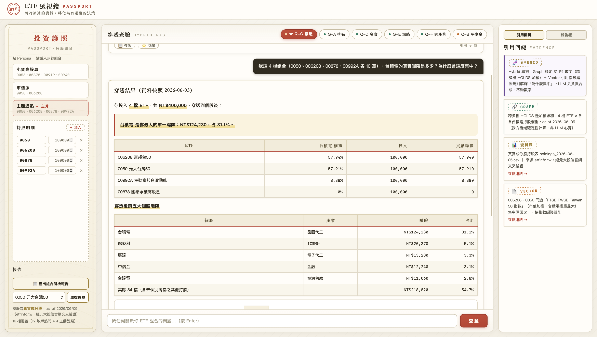

# ETF 透視鏡 PASSPORT

> 把冷冰冰的公開說明書，30 秒變成有溫度的曝險決策。
>
> 一個用 **Hybrid RAG（Graph + Vector）** 打造的台股 ETF 穿透分析助手：丟進你手上的幾檔 ETF，馬上看清你「真正」重押了哪幾檔個股。

---

## 🏆 關於這個競賽

這個專案是 **2026 精誠集團 AI 創新競賽**（主辦：**精誠資訊 SYSTEX**）的參賽作品，並獲得 **AI 駕馭獎**。

競賽在做什麼：主辦方提供企業級 AI 平台 **EAP（Enterprise AI Platform，`cloud.geminidata.com`）**，要求各隊在上面設計一套**結合 Graph RAG 與 Vector RAG 的混合式檢索應用**——自己找資料源、做資料清洗與溯源、設計知識圖譜 schema 與 system prompt（Robot Setting），最後做出一個能現場操作的 Demo，向評審展示「如何把公開資料轉化成有價值的決策」。評分涵蓋應用情境、技術深度、整合創新、介面設計與現場 Demo。

本作品選的題目是 **ETF 穿透分析**：台股 ETF 受益人已突破 1,458 萬，但多數散戶並不知道自己手上幾檔 ETF 穿透到個股後，其實高度重疊、重押在同一籃股票上。

---

## 💡 這是什麼

ETF 透視鏡 PASSPORT 接受一組「ETF + 投入金額」，把每檔 ETF **穿透到底層個股**，合併計算出整個組合對單一個股的**真實曝險**，並用自然語言回答「為什麼這麼集中」。

它解決的核心痛點：

> **你以為買了 4 檔 ETF 是分散，其實只是用 4 種包裝買了同一籃台積電。**

範例組合（各投入 10 萬，看似橫跨市值、高股息、主動式三種風格）：

| ETF | 投入 | 台積電權重 | 貢獻曝險 |
|---|---:|---:|---:|
| 0050 元大台灣50 | 100,000 | 57.91% | 57,910 |
| 006208 富邦台50 | 100,000 | 57.94% | 57,940 |
| 00992A 主動富邦台灣動能 | 100,000 | 8.38% | 8,380 |
| 00878 國泰永續高股息 | 100,000 | 0%（不持台積電） | 0 |
| **合計** | **400,000** | | **124,230 → 31.1%** |

四檔「看似分散」的 ETF，穿透後台積電一檔就佔了整個組合的 **31.1%**——因為 0050 與 006208 同追 FTSE TWSE Taiwan 50，光這兩檔就吃掉近 6 成台積電，而想用來稀釋的高股息 00878 根本一股台積電都沒有。

---

## 📸 實際畫面



左側輸入持股組合，中間即時算出穿透結果與台積電 31.1% 曝險、穿透後前五大個股，右側「引用回鏈」標示每個數字來自 Graph、Vector 還是原始資料源——讓每個結論都可追溯、可被當場核對。

---

## ⚙️ 運作原理

核心是一套 **Hybrid RAG** 架構，依問題類型路由到不同的檢索鏈：

```
使用者自然語言提問
        │
        ▼
  Query Router（在 Robot Setting 內）
        │
   ┌────┴───────────────┬─────────────────────┐
   ▼                    ▼                     ▼
數字 / 排序 / Top-N   為什麼 / 定義 / 差異     兩者都有（最常見）
   │                    │                     │
Graph RAG            Vector RAG            Hybrid：先取數再找佐證
（持股 HOLDS 邊）    （公開說明書/配息公告）   最後合成 + 引用回鏈
```

| | Graph RAG | Vector RAG |
|---|---|---|
| **負責** | 數字、權重、排名、穿透計算 | 語意、定義、為什麼、配息條款 |
| **資料** | 16 檔 ETF 真實成分股持股關係（`HOLDS` 邊，Neo4j v5 schema） | 公開說明書、指數編製規則、SITCA 收益分配公告 |

**最重要的設計原則：防幻覺。** 所有百分比與金額一律走確定性計算、**LLM 不准心算**；查無資料就回「尚無此資料」，絕不估算；每個數字都附引用回鏈到資料快照日期。

> 實作上踩到一個關鍵坑：EAP 平台自動產生的 Cypher 不可靠（會把 ticker 存成 float、無視指令重寫查詢並丟掉金額參數）。因此所有「數字型」答案改由自家後端 [`demo/penetrate.py`](demo/penetrate.py) 直接從快照 CSV 確定性計算，EAP 的 LLM 只負責質化敘述。這個「踩坑後的工程決策」本身就是把可靠性放在第一位的取捨。

完整四層架構（Use Case → API → Hybrid 知識網 → 資料源）見 [`research/architecture.md`](research/architecture.md)。

---

## 🧰 技術棧

- **後端**：Python · FastAPI · httpx（反向代理 EAP Chat API、隱藏 token、解決 CORS）
- **穿透計算引擎**：純 Python，從快照 CSV 確定性計算，可離線、可重算、附 self-test
- **前端**：原生 JavaScript · Tailwind · `marked`（Markdown）· `mermaid`（穿透流向圖）· 逐 token 顯現的串流效果
- **知識庫**：Graph（Neo4j v5 schema）+ Vector（公開說明書/公告），透過 EAP 平台匯入
- **資料**：16 檔 ETF 真實成分股快照（as-of 2026-06-05）+ 完整資料溯源

---

## 🚀 本地執行

```bash
cd demo
python3 -m venv .venv && source .venv/bin/activate
pip install -r requirements.txt
bash fetch_vendor.sh          # 下載前端 JS 依賴到 vendor/（一次性）
python3 server.py             # 開 http://localhost:8000
```

預設為**全程本地模式**：數字題走本地確定性計算、質化題走預錄回應，**完全不依賴外部網路**即可操作。若要改接真實 EAP 平台，複製 `demo/.env.example` 為 `demo/.env` 並填入 token 後取消前端「Mock」勾選。詳見 [`demo/README.md`](demo/README.md)。

---

## 📂 專案結構

```
.
├── demo/                # 穿透分析 Web App（FastAPI 代理 + 原生 JS 前端 + 本地計算引擎）
├── data/                # 16 檔 ETF 真實成分股快照 + 資料溯源與 AI 生成資料的 prompt
│   └── snapshot_2026-06-05/
├── research/            # 設計文件
│   ├── architecture.md      # 四層技術架構 + Hybrid RAG 路由
│   ├── graph_schema.cypher  # 知識圖譜 schema（Neo4j v5）
│   ├── prompt_design.md     # 三層 Prompt / Robot Setting 設計
│   └── etf_passport_research.md
├── eap_import_bundle/   # Hybrid RAG 知識庫匯入（Graph schema + Vector PDF + Robot Setting）
└── docs/                # 圖片素材與設計 spec
```

---

## 🔎 資料來源與真實性

所有 hero 數字（如 31.1% 穿透曝險）都能從 [`data/snapshot_2026-06-05/`](data/snapshot_2026-06-05/) 的 CSV 重算回來，避免「簡報講的」與「程式算的」不一致。

- **持股權重**：真實成分股，來源 etfinfo.tw，經元大投信官網交叉驗證，as-of 2026-06-05
- **配息來源占比**：真實，來自 SITCA 收益分配公告
- **受益人結構 / ESG / 主題標籤**：部分為 AI 生成示意資料，覆蓋有限，對應 prompt 完整記錄於 [`data/snapshot_2026-06-05/AI_GENERATED_PROMPTS.md`](data/snapshot_2026-06-05/AI_GENERATED_PROMPTS.md)

詳細真假分層與計算稽核見 [`data/snapshot_2026-06-05/README.md`](data/snapshot_2026-06-05/README.md)。

---

## ⚠️ 免責聲明

本專案為競賽與技術展示用途，所有內容**不構成任何投資建議**。資料快照僅反映特定日期、且包含部分示意資料，請勿用於實際投資決策。
