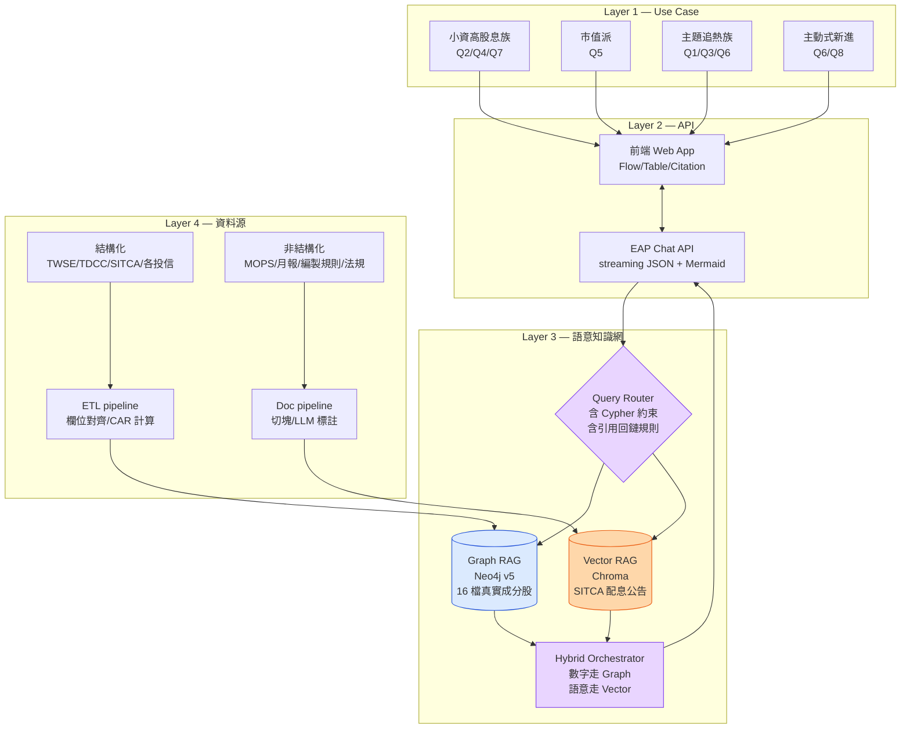

# ETF 透視鏡 PASSPORT — 四層技術架構

對應簡報 P9（範例「風雲智策」P11 的高分動作 #2：4 層分層、Graph 在左、Vector 在右）。
資料流：**原始資料 → 清洗 → Graph schema / Vector embedding → EAP 索引 → Chat API → 使用者**（呼應主辦鐵則 5.1）。

---

## Layer 1 — Use Case（最上層：使用者 / 場景）

```
┌─ 小資高股息族 ──┐  ┌─ 市值派 ──────┐  ┌─ 主題追熱族 ──┐  ┌─ 主動式新進 ─┐
│ 0056+00878+00919│  │ 0050 / 006208 │  │ 電動車/AI ETF │  │ 00992A 等    │
│ Q2 跨多檔穿透   │  │ Q5 哲學差異   │  │ Q1 名實相符   │  │ Q6 月報觀點  │
│ Q4 配息政策     │  │ 即時權重      │  │ Q3 漂綠檢測   │  │ Q8 法規衝擊  │
│ Q7 重複曝險     │  │               │  │               │  │              │
└─────────────────┘  └───────────────┘  └───────────────┘  └──────────────┘
```

對應決賽評分：**1. 應用情境與商業價值 20%**

---

## Layer 2 — Application & API（前端 + EAP Chat API）

```
                    ┌────────────────────────────────────────────────┐
                    │  前端 Web App（React + Tailwind + Streaming）  │
                    │  ┌────────┬────────┬─────────┬──────────────┐ │
                    │  │ 自然   │ 流向圖 │ 表格/雷達│ 引用回鏈     │ │
                    │  │ 語言   │ Flow   │ Table   │ Citation     │ │
                    │  │ 對話框 │        │         │ 00878 公告   │ │
                    │  └────────┴────────┴─────────┴──────────────┘ │
                    │         Markdown render + Mermaid render       │
                    └─────────────────┬──────────────────────────────┘
                                      │  HTTPS / SSE
                                      ▼
                    ┌────────────────────────────────────────────────┐
                    │ EAP Chat API（cloud.geminidata.com/api/v1）   │
                    │ POST /chat/create        建室                  │
                    │ POST /chat/{id}          送問 (streaming JSON) │
                    │ GET  /chat/{id}/messages 讀歷史                │
                    │ POST /chat/{id}/{mid}/chartgen  圖表生成       │
                    └─────────────────┬──────────────────────────────┘
                                      ▼
                    Robot Setting（System Prompt — 見 eap_import_bundle/robot_setting.txt）
                    含：角色／決策樹／數字鐵則／Cypher v5 約束／引用格式
```

對應決賽評分：**2. 技術應用 20%（API 串接）+ 4. 介面設計 15%**

---

## Layer 3 — 語意知識網 Hybrid Knowledge Net（核心，雙鏈並列）

```
┌──────────────────────── Query Router（在 Robot Setting 內） ────────────────────────┐
│  if (含時間/排序/Top-N)        → Graph                                               │
│  if (含為什麼/差異/定義)       → Vector                                              │
│  if (兩者都有，最常見)         → Hybrid：Graph 取數 → Vector 找佐證 → 合成          │
└──────────────────────────────────────┬───────────────────────────────────────────────┘
                                       │
                ┌──────────────────────┴──────────────────────┐
                ▼                                              ▼
┌─────────── Graph RAG（左）─────────┐       ┌────────── Vector RAG（右）──────────┐
│ Neo4j v5（Memgraph 亦可）           │       │ Chroma / pgvector                   │
│                                     │       │                                     │
│ 節點：                              │       │ Embedding：text-embedding-3-small   │
│  ETF / Stock / Issuer / Index       │       │   或 BGE-M3（中文友善）             │
│  Theme / Sector / Document          │       │                                     │
│  DividendEvent / MonthlyView        │       │ 切塊規則：500 token、章節邊界優先   │
│  InvestorBucket / RegulatoryEvent   │       │ Metadata：{etf, doc_type, page,     │
│                                     │       │            section}                 │
│ 主邊：                              │       │                                     │
│  HOLDS{date,weight_pct,shares}      │       │ Document type：                     │
│  PAID, TRACKS, LABELED_AS,          │       │   prospectus / monthly / quarterly  │
│  BELONGS_TO_THEME, ISSUED_BY,       │       │   annual / index_methodology /      │
│  HOLDER_DIST, AFFECTS               │       │   disclosure / press_release        │
│                                     │       │                                     │
│ Hero Cypher（無 OVER()）：          │       │ 檢索：top_k=6 + Cohere reranker     │
│  Q2 跨多檔穿透 / Q1 名實相符 /     │       │                                     │
│  Q3 漂綠 / Q4 配息 / Q7 重疊 /     │       │ 量級：8,000–11,000 chunks           │
│  Q8 法規影響                        │       │       ~50 MB（1536 維）             │
│                                     │       │                                     │
│ 量級：16 檔真實成分股 HOLDS 邊      │       │ Hero retrieval：                    │
│                                     │       │  Q5 投資哲學（公開說明書 + 月報）   │
│                                     │       │  Q4 收益平準金條款                  │
│                                     │       │  Q6 月報觀點抽取                    │
└─────────────────────────────────────┘       └─────────────────────────────────────┘
                ▲                                              ▲
                └──────────────── Hybrid Orchestrator ─────────┘
                       LLM 合成：把 Graph 數字 + Vector 語意 + 引用回鏈拼成回答
                       核心：數字一律走 Graph、語意一律走 Vector、不准 LLM 心算
```

對應決賽評分：**2. 技術應用深度 20%（雙鏈是核心）+ 3. 整合創新 15%（Hybrid 編排是 Vibe Coding）**

---

## Layer 4 — 資料源 + 蒐集處理（最底層）

```
═══ 結構化資料源（→ Graph）═══════════════════════════════════════════════
TWSE OpenAPI    →  /v1/opendata/t187ap47_L            (16 檔基本資料)
                   /v1/ETFReport/ETFRank              (定期定額排行)
                   /v1/opendata/t187ap46_*            (ESG 揭露 22 子表)
mis.twse iNAV   →  data/all_etf.txt                   (即時淨值，每 15 秒；快照用)
TDCC OpenAPI    →  getOD.ashx?id=2-41                 (ETF 月分析；fallback 爬蟲)
                   smWeb/qryStock                     (股權分散 15 級距)
SITCA           →  ETF 明細頁 (爬蟲)                  (規模、市佔)
TPEx OpenAPI    →  /tpex_index_consti, /tphd_consti…  (櫃買指數 ETF 用)
各投信網站      →  PCF 每日籃子、月底持股權重         (元大/國泰/富邦/群益/復華 5 家覆蓋 9 檔)
TWSE 配息頁     →  ETF 收益分配查詢 (爬蟲)            (除息/發放日、單位金額)
集保 fundclear  →  ETF 觀測站                          (跨投信整合驗證)
                                            ▼
                                    ┌──────────────┐
                                    │ ETL pipeline │
                                    │  · 抓取/排程 │
                                    │  · 欄位對齊   │
                                    │  · 單位歸一   │
                                    │  · QoQ/YoY 計算│
                                    │  · CAR (5/20/60d) │
                                    └──────┬───────┘
                                           ▼
                              Neo4j v5（DDL: graph_schema.cypher）

═══ 非結構化資料源（→ Vector）═══════════════════════════════════════════
MOPS 公開說明書       →  t57sb01_q7              (16 檔 × 150 頁 ≈ 2400 頁)
各投信月報 / 季報 / 年報 (PDF)                    (16 × 12 月 ≈ 192 份)
臺灣指數公司編製規則  →  /downloads/compilation_rule (8 份不重複)
TWSE 收益分配新制     →  market_insights/...      (法規說明)
SITCA 收益分配公告    →  sitca.org.tw/FundNote    (16 檔配息來源占比，含收益平準金)
                                            ▼
                                    ┌──────────────┐
                                    │ Doc pipeline │
                                    │  · pdfplumber/PyMuPDF│
                                    │  · OCR fallback│
                                    │  · 章節切塊   │
                                    │    (prompt §3.4)│
                                    │  · LLM tagging│
                                    │    主題/觀點/拆解│
                                    └──────┬───────┘
                                           ▼
                              Chroma / pgvector（embedding + metadata）

═══ AI 生成資料（必附 prompt — 鐵則 5.1）═══════════════════════════════
個股真實主題標註 → BELONGS_TO_THEME (寫回 Graph) — prompt §3.1
ETF 月報觀點抽取 → MonthlyView 節點             — prompt §3.2
配息來源拆解     → DividendEvent.source_breakdown — prompt §3.3
公開說明書章節   → Vector chunks metadata         — prompt §3.4
```

對應決賽評分：**2. 技術應用 20%（資料溯源乾淨）+ 5. Demo 30%（可被引用回鏈追溯，法遵級）**

---

## 完整資料流（一句話版本，呼應鐵則 5.1）

```
原始資料（TWSE/TDCC/SITCA/MOPS/投信/法規）
   ↓ 清洗（pipeline：欄位對齊、PDF 切塊、LLM 標註，全部附 prompt）
Graph schema（Neo4j v5，HOLDS 主邊）  +  Vector embedding（Chroma，章節 metadata）
   ↓ 索引到 EAP（Robot Setting + Project 載入）
Chat API（streaming JSON + Mermaid）
   ↓
使用者前端（自然語言 → 穿透流向圖/表格 + 引用回鏈）
```

---

## 簡報 P9 製作建議（給 PPT 設計師看）

- **整頁結構**：4 層由上而下，Graph **左**、Vector **右**（範例「風雲智策」P11 的高分版型）
- **顏色編碼**：Graph 線條冷色（藍）、Vector 線條暖色（橘）、Hybrid 合流處紫
- **每層底色**：Use Case 淺黃、API 淺綠、KN 淺紫、Data 淺灰
- **箭頭**：實線=主資料流；虛線=fallback / AI 生成
- **右下角標籤**：「2. 技術應用規劃」（鐵則：每頁標評分項）
- **Mermaid 渲染版**：見下方，可直接貼進 EAP chat 或前端示範

---

## Mermaid（簡報附錄 / 前端展示用）


